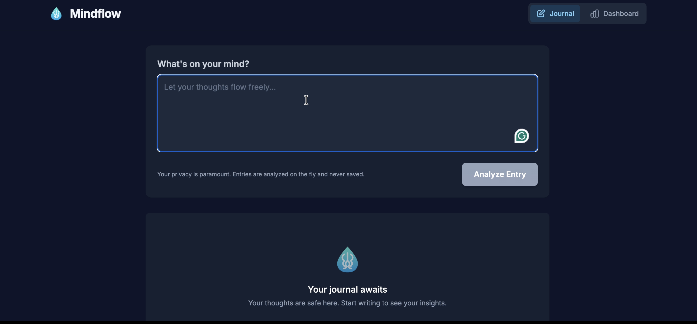

<div align="center">
   <a href="https://github.com/abhijatsarari/mindflow">
      
   </a>

   <h1>Mindflow 🧠✨</h1>
   <p><em>Your Private AI Journal for Mental Clarity and Well-being.</em></p>
</div>

---

## 🚀 Features

- **AI-Powered Analysis**: Sentiment, emotions, and triggers extracted from each entry.
- **Personalized Suggestions**: Actionable wellness tips based on your writing.
- **Concise Summaries**: One-sentence summaries for quick review.
- **Wellness Dashboard**: Visual charts showing trends over time.
- **Privacy First**: Entries are analyzed in-memory only and are not stored.
- **Sleek UI**: Built with React + TypeScript and Tailwind CSS.

---

<div align="center">
   <a href="https://github.com/abhijatsarari/mindflow">
      
   </a>
</div>

## 🛠️ Tech Stack

- Frontend: React + TypeScript
- AI Model: Google Gemini (gemini-2.5-flash)
- Styling: Tailwind CSS
- Charts: Recharts
- Dev Server: Vite

---

## ⚙️ How It Works

1. You write a journal entry in the app.
2. The text is sent to the Gemini API with a structured prompt.
3. The model returns a JSON analysis (sentiment, emotions, triggers, suggestions).
4. The app displays the parsed insights and updates the dashboard in-memory.

Crucially: the raw text and analysis live only in the session memory and are not persisted.

---

## Getting Started

Clone the repository and run locally with Vite.

```bash
git clone https://github.com/abhijatsarari/mindflow.git
cd mindflow
```

Install the (dev) tooling and run the dev server. This project uses Vite — you can either use a global Vite install or the npm scripts.

If you prefer the global Vite CLI:

```bash
npm install -g vite
vite
```

Or use npm scripts (recommended when scripts are defined in `package.json`):

```bash
npm install
npm run dev
```

### Environment

Create a file called `.env.local` in the project root with your Gemini API key if you plan to run analysis locally:

```
GEMINI_API_KEY=your_gemini_api_key_here
```

> Note: This repo includes the `geminiService` wiring in `services/geminiService.ts`. For local development you must supply a valid key and follow Google API usage limits and policies.

---

## 📄 License

This project is licensed under the MIT License — see the `LICENSE` file for details.

---

If you'd like help adding a GitHub Actions workflow to automatically lint or preview the app on push, tell me and I can add a minimal workflow.
